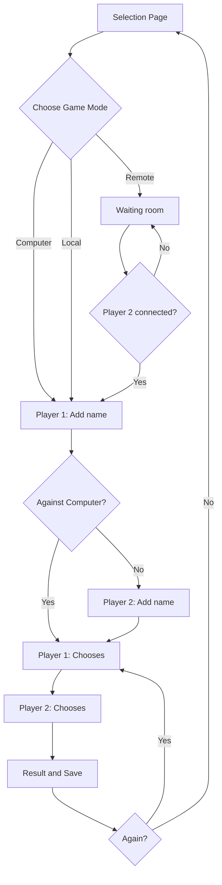

# JAN - KEN - PON (rock - paper - scissors)

 

# The Coding Challenge

This coding challenge is to implement a two-player game of rock, paper, scissors in the web
browser.

## How to run the proyect

- Run `npm i` to install the proyect dependecies.
- Run `npm run start` to start the application.

## Rules

**HONOR RULES:** You must do this challenge on your own, without assistance or review from others, and without copy-pasting from the Internet.

**TIME LIMIT:** Timebox this challenge to 3 hours and send us within 3-5 working days from the date you receive this. You may submit your work earlier.

**SUBMISSION:** Please send us your submission as a Github repository.

## Requirements

The basic requirements for the game are:

- Allow two players to enter their names.

- One of the players can also be the computer, i.e. player vs computer.

- Allow each to play a turn, one at a time, during which the player selects one of the option from rock, paper, scissors.

- During each turn notify who has won and increment the scores.

- In addition to implementing basic gameplay, the user must be able to save their game.

- You can choose to code the UI only or Backend only or both UI and Backend. However, timebox it to 3 hours and let us know how much you were able to achieve and what improvements you would have worked on if you had more time. We would like to read your documentation on this.

- The goal is for players to play in the same browser.

- **OUT OF SCOPE:** Multiplayer solution that allows players to join from different browsers.

## Guidance

- We don’t expect completeness. We are interested in your thought process and
  problem-solving approach. This coding challenge is a base for the next round of
  technical discussions.

- We want to assess your coding skills and understand your decisions in the design and implementation of the assignment.

- We value your time and the effort that goes into interviewing. We recommend not to
  spend more than 3 hours on this, however, it is up to you how you want to work on this coding challenge and come back to us with your solution. What we are interested in is hearing what you were able to achieve in these 3 hours and what further ideas and improvements you would have worked on if you had more time.

- There is no objectively right or wrong approach, and we are not primarily interested in a complete or polished solution. We encourage you to timebox your work to 3 hours or less.

 

# The Approach

According to the requirements:

- Both players playing on the same computer and by turns means different "states" so we will need to create a "state machine".
- Players can choose to play alone or play against the computer, which it means we will need a 'page' to select that aside of the game 'page'.
- Player/s need to add their name and save their score. That means we need to save both: name and score somewhere. The future storage could be a database but that will require some login/auth, etc. For this MVP we will store that info in the browser. Cookies could work, but I will use localStorage.

# The Diagram

_This diagram has been made using the [Mermaid extension for markdown](https://mermaid.js.org/)._

_Remote playing mode has been simplify on the diagram for clarity of the rest of the app._

 

# Out of Scope

## Play from different Browser

This whole branch of the diagram has not been implemented.
Ideally this can be achieved with Websockets.
The player 1 will open the conection and will listen until Player 2 connects.
Once both responses are OK we can start playing.

## Switch from localStorage to server Database

Create middleware and backend.

## Add Lizard and Spock _(Rock, Paper, Scissors, Lizard, Spock)_

Store matrix on a HashMap.

## More than 2 players

Add some logic to remove losers and remain the undefeated.
